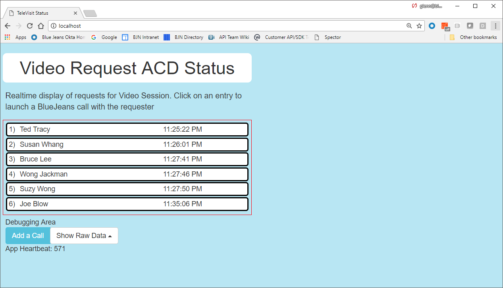
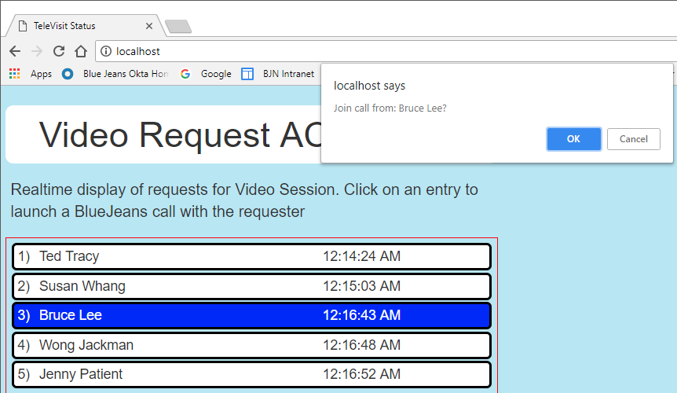
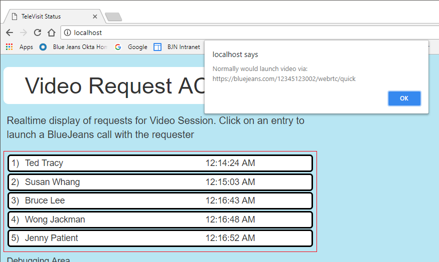
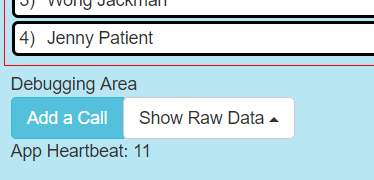
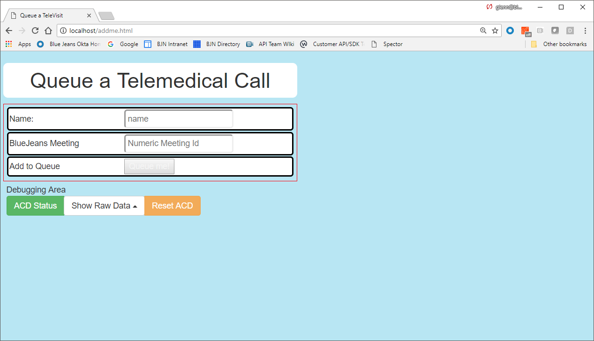

# Simple ACD - a Simple NodeJS BlueJeans Video ACD

- 11/7/2022, g1, redeploy to heroku
- 5/18/2018, g1, Initial Check-in

This reference design shows how one might construct a small formfactor Automatic Call Distribution (ACD) server for queueing BlueJeans Video call requests.

## Setup
To use the Video ACD, you will need to have the Node JS environment including the package manager too, **npm**.

1. Download the contents of this github to your computer.  Then run the initialization

	`npm install` to have npm download and install the npm modules

1. Launch the node web server

	`node acd.js`  this should display the following

	`C:\Users\glenn\Documents\node\simpleACD>node acd.js`
`*** ACD is up and listening on Port: 80`

1. Open your browser and then browse to:
	
	`http://localhost`

At this point you should see the following screen:

Running The Page

This page ***continuously*** polls the ACD web service for updates to calls in queue.  You do not need to do any refresh of the page.

At any point you may dequeue a call to simulate joining a BlueJeans session with the caller

### Dequeueing a Video Call Request

The main page is continually updated to reflect the realtime state of people queued requesting to be on a video call.  To simulate accepting and joining a video call, simply click on the desired entry in the queue.

After clicking on a caller, you will see a confirmation dialog:

Clicking on the **Ok** button will take you to the step that would normally cause your browser to put you into a BlueJeans video session either by
- WebRTC (if on Chrome or Firefox), *or*
- Launch the BlueJeans Desktop Client (Windows or Mac).

***Additionally*** the ACD will dequeue that caller so no one else will be able to initiate a session with your selection.

## Debugging Utility

This reference application also includes a page that allows you to configure the demonstration environment:

- Enter additional simulated calls-in-queue
- Reset the ACD to it initial state of *simulated* calls waiting.

To access this configuration page, click on the **Add a Call** button

You will be shown the utility page:

To add another call in waiting

1. Enter a name for the individual in queue
2. Provide a BlueJeans meeting number (again, this is *simulated* so you don't actually have to schedule a meeting)
3. The **Queue Me** button will become active - click on it to send put this individual into the ACD queue

If you wish to reset the ACD back to its initial state of simulated calls-in-waiting, click on the **Reset ACD** button.

